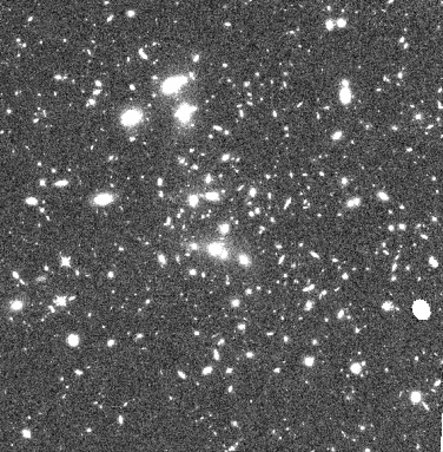

  

The goal of this project is to create a convolutional neural network that is trained to anylize images from the Hubble Space Telescope (HST) and identify supernovae.  

In order to locate supernovae, we must compare multiple images of the same spot in space, taken at different times. We must align and subtract these images, using TweakReg and AstroDrizzle, in order to locate any differences in light, which may indicate a supernova.   

The training data consists of real aligned and drizzled images from the HST archive with false supernovae planted into them. Once trained, the neural network will be run over all images in the Hubble Space Telescope archive.  

I have learned a lot over the course of this project, especially as it is my first project programmed in Python. I have done all of the programming for this project so far with the help of my mentor Dr. David Rubin.  

Here is a link to the project Github: 
https://github.com/sierranmorales/Finding-Supernovae

