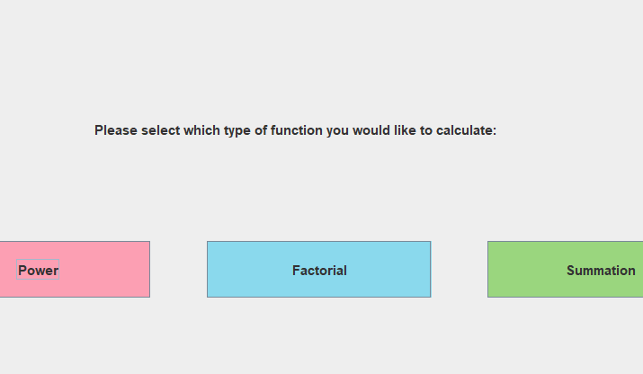
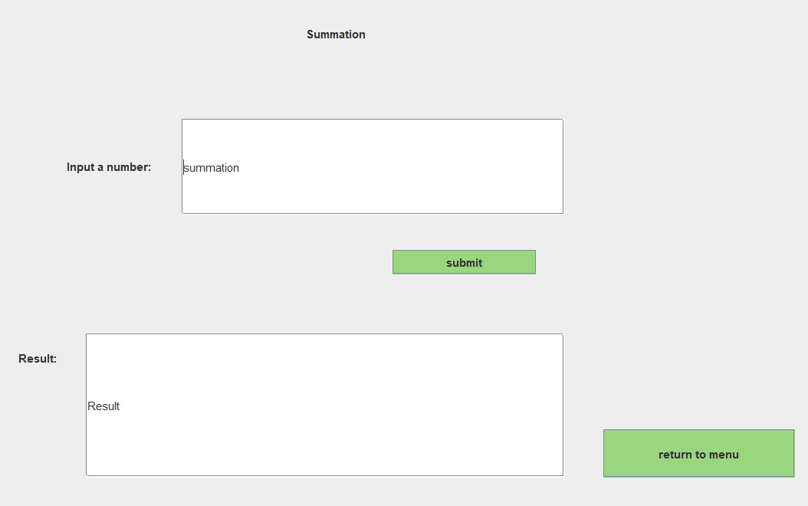

  
  

This project is a calculator that performs power, factorial, and summation calculations using recursive methods. It also contains an interactive GUI. All of this is programmed in Java without the use of outside libraries or frameworks. 

The GUI front page contains a prompt and 3 buttons, one "power," one "factorial," and one "summation." 

The user selects one of the options and is then taken to a second page that contains fields to input numbers to be calculated, as well as a "submit" and an "exit" button. 

This project was memorable to me because it was the first (and only) time that I have created a GUI using Java. It was also a good practice of recursion, as all of the calculations are performed recursively.
