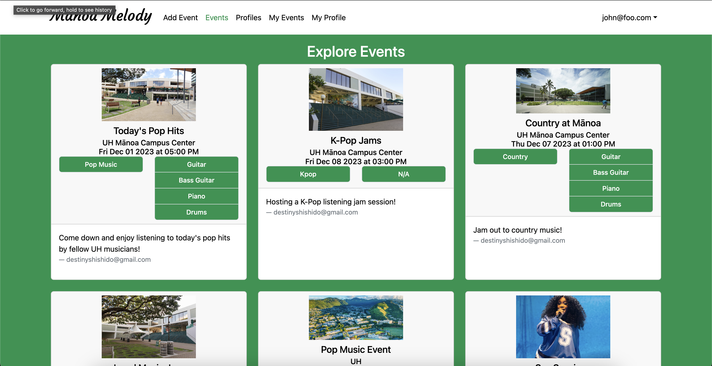
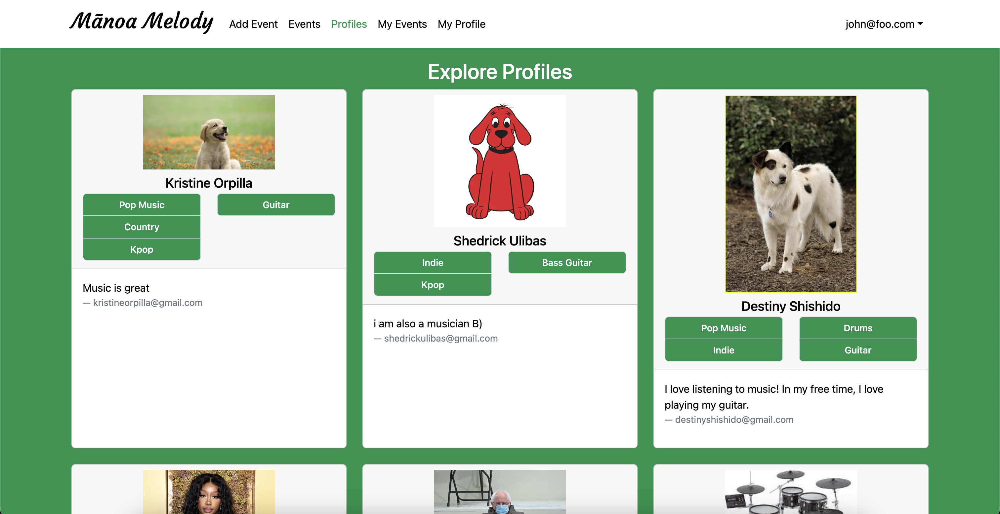

  

<h3>Vision and Goal</h3>
Mānoa Melody hopes to resolve an ongoing issue that many UH students with musical talents 
have been facing – being able to connect with other students who share the same musical tastes, 
talents, and capabilities.

  
There are many ways for students to connect and start a friendship with others. Having similar musical 
interests is one of them. This application will also cater to these students that want to 
find friends of similar music tastes. Not only that, it can also help small artists be discovered and gain a platform.

<h3>Functionality</h3>
  
When you first open the website, you will be met with a home page that provides some information about Manoa Melody. 
In order to access the main site, you must either create an account or sign in.

  
The main functionality of the website is the ability to create Events, and browse through other users' events and profiles. 
 

  
Each user is also able to view and edit their own profile as well as all events they created. There is also an admin 
feature for accounts with admin priveledges that grants the ability to delete events and profiles.

  
This application was created by Shedrick Klifford Ulibas, Harvey Dayne Lafradez, Kristine Orpilla, Destiny Shishido, and Sierra Morales

  
My primary contributions are the creation of the collection schemas, the creation of the "Profiles" 
page where you can browse through other users' profiles, some work on the "Events" page, where you can browse through all events, 
and the creation of the admin page and admin delete feature. 

