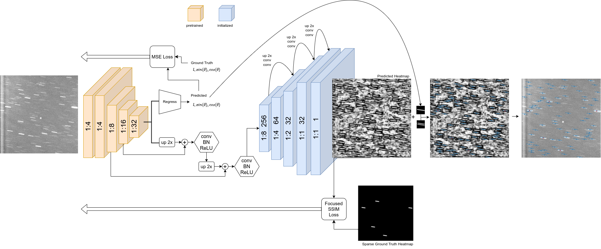
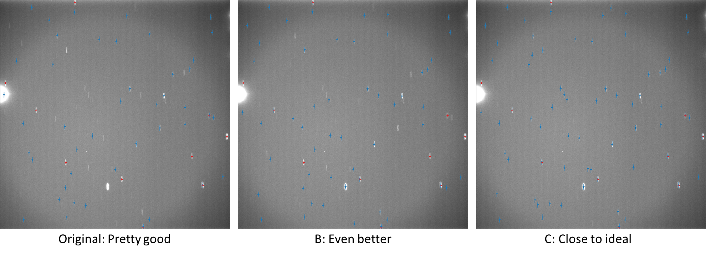

<h3>Abstract</h3>
Space domain awareness (SDA) is a term describing the study and monitoring of satellites and debris in Earth orbit.  Machine learning models are currently being used by Space Systems Command (SSC) for this purpose. This project aimed to improve current machine learning models used to track objects in space, as well as to optimize the current image processing pipeline. 

A critical aspect of SDA is the detection of stars to locate objects in space. Accurately identifying the positions of stars is essential for determining the precise locations of objects in Earth orbit, which is important for avoiding collisions and detecting changes. Existing models struggle with learning the shape of star streaks, which are elongated representations of stars in sidereal tracking images. These streaks can vary in length and angle, making it challenging for current models to predict them with a high enough efficacy and efficiency. 

In this project, the current star detection neural network was modified by appending convolutional layers to the feature extractor of the pretrained model, as well as to the end of the model, thus allowing the network more capacity to learn star streak angles and lengths. This project also aimed to reduce image processing time and increase performance by analyzing and determining the optimal number of star annotations, and by re-engineering sections of the codebase in a more efficient manner.  We demonstrated that these modifications drove improved model performance, increased annotation efficiency, and improved astrometric accuracy.
  

<h3>Part 1</h3>
<ul>
  <li>
    Make duplicate of original model (StarCSPB) and modify to append more convolutional layers to the feature extractor of the       base model (ResNet-50)</li>
  <li>
    Make second duplicate of original model (StarCSPC) and append more convolutional layers at the end of the base StarCSP model 
  </li>
  <li>
    Run models
  </li>
  <li>
    Make second duplicate of original model (StarCSPC) and append more convolutional layers at the end of the base StarCSP model 
Run models
  </li>
  <li>
    Train models on dataset and assess efficacy
  </li>
</ul>

  
The main functionality of the website is the ability to create Events, and browse through other users' events and profiles. 
  

 

 
As you can see, StarCSPC performed much better than the original and StarCSPB, so all further evaluation is done using StarCSPC.
  

<h3>Part 2</h3>
<ul>
  <li>
    Adjust number of annotations and assess efficacy. 
  </li>
</ul>
 

Previous brief testing showed that more annotations is not always better. I trained the model using different number of annotations (1, 2, 5, 10, 20, 40, 80). Here are the resulting WCS fit rates by number of annotations:
 

 
Surprisingly, 1 annotation resulted in the best/highest WCS fit rate.
  

Here are the resulting astrometric residuals.

<h3>Conclusion</h3>
<ul>
  <li>
    Architecture changes lead to 5% increase in WCS fit rate
  </li>
  <li>
    Improved model far exceeds Air Force Space Command requirements for sensors contributing to the Space Surveillance Network (SSN)
  </li>
  <li>
    Decreased model analysis time by 10x (from 10 seconds per frame to 1)
  </li>
</ul>

